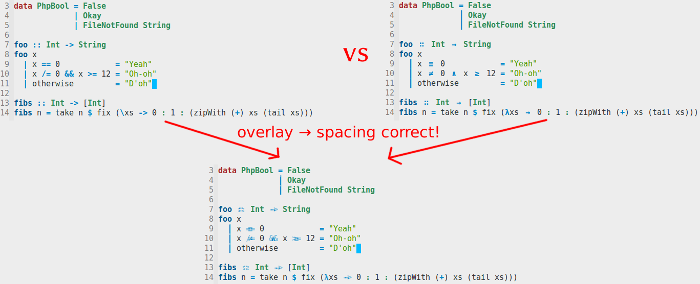

Lambda-Lifting Mode
===================

Description
-----------

This is a **PROOF OF CONCEPT** minor mode with the same goal like
[Pretty Lambda][1] and Haskell Mode’s [Unicode Symbols][2]. This mode will find
some ASCII operators and replace them with nice looking Unicode glyphs. The
replacement is only done visually and will not affect the saved files. In
contrast to all the other solution this mode is meant to **not break your
alignment**. All the replaced glyphs are spaced accordingly so that they take
as much space as the old text.

[1]: http://www.emacswiki.org/cgi-bin/wiki/PrettyLambda
[2]: https://www.haskell.org/haskellwiki/Emacs/Unicode_symbols

Example
-------

Installation
------------

This file is compatible with Emacs’ package manager. Just load the
`lambda-lifting-mode.el` file into a buffer and run `M-x
package-install-from-buffer`.

The following shell snippet will automatically download and install the package:

    file=$(mktemp)
    curl -o "$file" 'https://raw.githubusercontent.com/haliner/lambda-lifting/master/lambda-lifting-mode.el'
    emacs --batch --eval "(package-install-file \"$file\")"
    rm "$file"

Usage
-----

The minor mode is by default not activated. To toggle the minor mode just type
`M-x lambda-lifting-mode`.

If you want to enable this minor mode for Haskell files, add the following to
your emacs initialization file:

    (add-hook 'haskell-mode-hook 'lambda-lifting-mode)

Known Issues
------------

  - This minor mode makes excessive use of overlays. Overlays are really
    slow. Typing in large files will be no fun.

    Solution: The mode will be modified to use text properties
    instead. Unluckily text properties do not offer all the functionality this
    mode needs. The idea is to tag the operators during fontification and use
    other Emacs hooks (`window-scroll-functions` and friends) to get rid of
    currently invisible overlays. Text which is going to be displayed will be
    decorated with overlays by using the information of the text properties.

    This should boost the performance of this minor mode and remove the input
    lag.

  - List of substitutions is not exhaustive.

  - Usefulness of some substitutions is arguable.

License
-------

    Copyright (C) 2014  Stefan Haller

    This program is free software: you can redistribute it and/or modify
    it under the terms of the GNU General Public License as published by
    the Free Software Foundation, either version 3 of the License, or
    (at your option) any later version.

    This program is distributed in the hope that it will be useful,
    but WITHOUT ANY WARRANTY; without even the implied warranty of
    MERCHANTABILITY or FITNESS FOR A PARTICULAR PURPOSE.  See the
    GNU General Public License for more details.

    You should have received a copy of the GNU General Public License
    along with this program.  If not, see <http://www.gnu.org/licenses/>.
